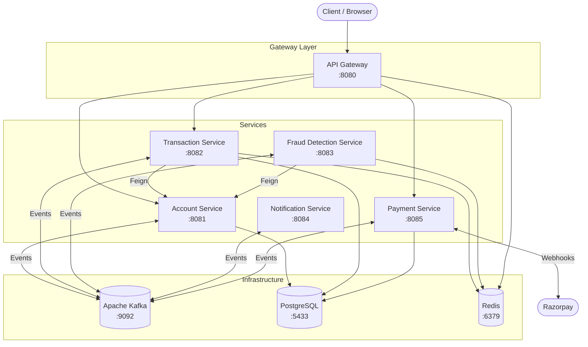
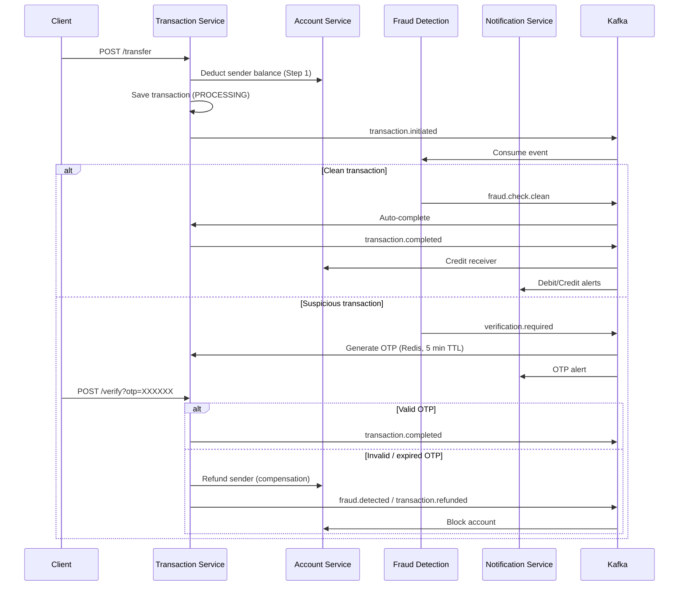

# Java Banking System

A distributed banking platform built with **Spring Boot microservices**, demonstrating event-driven architecture, the **SAGA pattern** for distributed transactions, real-time **fraud detection**, and **Razorpay** payment integration.

---

## Table of Contents

- [Overview](#overview)
- [Features](#features)
- [Architecture](#architecture)
- [Tech Stack](#tech-stack)
- [Microservices](#microservices)
- [Prerequisites](#prerequisites)
- [Getting Started](#getting-started)
- [API Reference](#api-reference)
- [Kafka Topics](#kafka-topics)
- [Transaction Flow (SAGA)](#transaction-flow-saga)
- [Fraud Detection](#fraud-detection)
- [Project Structure](#project-structure)
- [Testing](#testing)
- [Repository](#repository)

---

## Overview

This project models a production-style banking backend as a set of independently deployable Spring Boot services. Clients interact through a **Spring Cloud Gateway** that routes requests to domain services and applies **Redis-backed rate limiting**.

Core capabilities include account lifecycle management, peer-to-peer fund transfers with compensating transactions, rule-based fraud screening with OTP verification, asynchronous notifications via Kafka, and external payment processing through Razorpay webhooks.

---

## Features

- **Microservices architecture** — six domain services with clear bounded contexts
- **API Gateway** — unified entry point with per-route rate limiting (Redis)
- **Event-driven communication** — Apache Kafka for async, decoupled workflows
- **SAGA pattern** — orchestrated fund transfers with automatic compensation on failure
- **Fraud detection** — velocity, amount, and balance-based checks with OTP step-up verification
- **Payment integration** — Razorpay order creation and webhook handling
- **Notification service** — event-driven alerts for transactions, fraud, refunds, and payments
- **OpenAPI documentation** — Swagger UI on all REST-exposed services
- **Containerized infrastructure** — Docker Compose for Kafka, PostgreSQL, and Redis

---

## Architecture



### Service Ports

| Service | Port | Exposed via Gateway |
|---------|------|---------------------|
| API Gateway | `8080` | — |
| Account Service | `8081` | Yes |
| Transaction Service | `8082` | Yes |
| Fraud Detection Service | `8083` | No (Kafka consumer) |
| Notification Service | `8084` | No (Kafka consumer) |
| Payment Service | `8085` | Yes |
| Kafka | `9092` | — |
| Kafka UI | `8090` | — |
| PostgreSQL | `5433` | — |
| Redis | `6379` | — |

---

## Tech Stack

| Layer | Technology |
|-------|------------|
| Language | Java 26 |
| Framework | Spring Boot 4.0.7 |
| Cloud | Spring Cloud Gateway 2025.1.2, OpenFeign |
| Messaging | Apache Kafka (KRaft mode) |
| Database | PostgreSQL 17 |
| Cache / Rate Limiting | Redis 7 |
| ORM | Spring Data JPA / Hibernate |
| API Docs | SpringDoc OpenAPI 3.0.2 |
| Payments | Razorpay Java SDK |
| Build | Maven (wrapper included) |
| Infrastructure | Docker Compose |

---

## Microservices

### Account Service (`8081`)

Manages customer accounts — creation, balance queries, blocking, and balance mutations used by the SAGA workflow.

- Persists accounts to PostgreSQL
- Consumes `transaction.completed` to credit receiver accounts
- Consumes `fraud.detected` to block compromised accounts

### Transaction Service (`8082`)

Orchestrates peer-to-peer fund transfers using the SAGA pattern.

- Deducts sender balance synchronously via OpenFeign
- Publishes `transaction.initiated` for fraud screening
- Handles OTP verification for flagged transactions
- Executes compensating refunds on failure or expiry

### Fraud Detection Service (`8083`)

Rule-based fraud engine that evaluates every initiated transaction.

- **Velocity check** — max 5 transactions per account per minute
- **Amount check** — flags amounts exceeding 5× the running average
- **Balance check** — flags transfers above 90% of account balance
- Publishes `verification.required` or `fraud.check.clean`

### Notification Service (`8084`)

Kafka-driven alert dispatcher (currently logs notifications; designed for email/SMS integration).

- Listens to transaction, fraud, refund, and payment events
- Sends structured alerts for OTP, debit/credit, fraud blocks, and payment outcomes

### Payment Service (`8085`)

Integrates with Razorpay for external payment collection.

- Creates Razorpay orders and persists payment records
- Processes `payment.captured` and `payment.failed` webhooks
- Publishes `payment.completed` / `payment.failed` events

### API Gateway (`8080`)

Single entry point routing to account, transaction, and payment services.

| Route | Target | Rate Limit |
|-------|--------|------------|
| `/api/v1/account/**` | Account Service | 10 req/s, burst 20 |
| `/api/v1/transaction/**` | Transaction Service | 10 req/s, burst 20 |
| `/api/v1/payment/**` | Payment Service | 5 req/s, burst 10 |

Rate limiting is keyed by client IP and backed by Redis.

---

## Prerequisites

- **Java 26** (JDK)
- **Docker** and **Docker Compose**
- **Maven** (optional — each service includes `./mvnw`)
- **Razorpay test credentials** (for payment service)

---

## Getting Started

### 1. Clone the repository

```bash
git clone https://github.com/abhishektarun09/java-banking-system-microservices.git
cd java-banking-system-microservices
```

### 2. Start infrastructure

From the project root, start Kafka, PostgreSQL, Redis, and Kafka UI:

```bash
docker compose up -d
```

Verify containers are healthy:

```bash
docker compose ps
```

| Service | URL |
|---------|-----|
| Kafka UI | http://localhost:8090 |
| PostgreSQL | `localhost:5433` (user: `postgres`, password: `postgres`, db: `banking_db`) |
| Redis | `localhost:6379` (password: `app_password`) |

### 3. Configure environment variables

The payment service requires Razorpay credentials:

```bash
# Linux / macOS
export RAZORPAY_KEY=your_razorpay_key_id
export RAZORPAY_SECRET=your_razorpay_key_secret

# Windows PowerShell
$env:RAZORPAY_KEY="your_razorpay_key_id"
$env:RAZORPAY_SECRET="your_razorpay_key_secret"
```

### 4. Start microservices

Start each service in a separate terminal. Order matters — start infrastructure-dependent services after Docker is up.

```bash
# API Gateway
cd api-gateway && ./mvnw spring-boot:run

# Account Service
cd account-service && ./mvnw spring-boot:run

# Transaction Service
cd transaction-service && ./mvnw spring-boot:run

# Fraud Detection Service
cd fraud-detection-service && ./mvnw spring-boot:run

# Notification Service
cd notification-service && ./mvnw spring-boot:run

# Payment Service (requires Razorpay env vars)
cd payment-service && ./mvnw spring-boot:run
```

On Windows, use `mvnw.cmd` instead of `./mvnw`.

### 5. Verify the stack

Once all services are running, confirm the gateway is reachable:

```bash
curl http://localhost:8080/actuator/health
```

---

## API Reference

All client-facing REST endpoints are accessed through the gateway at `http://localhost:8080`.

### Swagger UI

| Service | Swagger URL |
|---------|-------------|
| Account | http://localhost:8081/swagger-ui.html |
| Transaction | http://localhost:8082/swagger-ui.html |
| Fraud Detection | http://localhost:8083/swagger-ui.html |
| Notification | http://localhost:8084/swagger-ui.html |
| Payment | http://localhost:8085/swagger-ui.html |

### Account Service

| Method | Endpoint | Description |
|--------|----------|-------------|
| `POST` | `/api/v1/account` | Create a new account |
| `GET` | `/api/v1/account/{accountNumber}` | Get account details |
| `GET` | `/api/v1/account/{accountNumber}/balance` | Get account balance |
| `PUT` | `/api/v1/account/{accountNumber}/block` | Block an account |
| `PUT` | `/api/v1/account/{accountNumber}/deduct?amount={amount}` | Deduct balance (SAGA step) |
| `PUT` | `/api/v1/account/{accountNumber}/credit?amount={amount}` | Credit balance (SAGA compensation) |

**Create account example:**

```bash
curl -X POST http://localhost:8080/api/v1/account \
  -H "Content-Type: application/json" \
  -d '{
    "accountHolderName": "Jane Doe",
    "email": "jane@example.com",
    "phone": "+1234567890",
    "accountType": "SAVINGS",
    "initialDeposit": 10000.00
  }'
```

Supported account types: `SAVINGS`, `CURRENT`, `FIXED_DEPOSIT`.

### Transaction Service

| Method | Endpoint | Description |
|--------|----------|-------------|
| `POST` | `/api/v1/transaction/transfer` | Initiate a fund transfer |
| `GET` | `/api/v1/transaction/{transactionId}` | Get transaction by ID |
| `GET` | `/api/v1/transaction/account/{accountNumber}` | Get transaction history |
| `POST` | `/api/v1/transaction/{transactionId}/verify?otp={otp}` | Verify OTP for flagged transaction |

**Transfer example:**

```bash
curl -X POST http://localhost:8080/api/v1/transaction/transfer \
  -H "Content-Type: application/json" \
  -d '{
    "senderAccountNumber": "123456789012",
    "receiverAccountNumber": "987654321098",
    "amount": 500.00,
    "description": "Rent payment"
  }'
```

**Transaction statuses:** `PENDING` → `PROCESSING` → `COMPLETED` | `PENDING_VERIFICATION` → `COMPLETED` | `FLAGGED` | `FAILED`

### Payment Service

| Method | Endpoint | Description |
|--------|----------|-------------|
| `POST` | `/api/v1/payment/create-order` | Create a Razorpay payment order |
| `POST` | `/api/v1/payment/webhook` | Razorpay webhook callback |

**Create payment order example:**

```bash
curl -X POST http://localhost:8080/api/v1/payment/create-order \
  -H "Content-Type: application/json" \
  -d '{
    "accountNumber": "123456789012",
    "amount": 99.99,
    "description": "Subscription fee"
  }'
```

A test checkout page is included at `payment-service/resources/payment-service-test.html` for manual Razorpay integration testing.

---

## Kafka Topics

| Topic | Producer | Consumer(s) | Purpose |
|-------|----------|-------------|---------|
| `transaction.initiated` | Transaction Service | Fraud Detection | Trigger fraud screening |
| `fraud.check.clean` | Fraud Detection | Transaction Service | Auto-complete clean transactions |
| `verification.required` | Fraud Detection | Transaction Service | Request OTP verification |
| `transaction.otp.generated` | Transaction Service | Notification Service | Deliver OTP alert |
| `transaction.completed` | Transaction Service | Account Service, Notification Service | Credit receiver & notify |
| `transaction.refunded` | Transaction Service | Notification Service | Notify refund |
| `fraud.detected` | Transaction Service | Account Service, Notification Service | Block account & alert |
| `payment.completed` | Payment Service | Notification Service | Payment success alert |
| `payment.failed` | Payment Service | Notification Service | Payment failure alert |

---

## Transaction Flow (SAGA)



---

## Fraud Detection

Fraud rules are configurable in `fraud-detection-service/src/main/resources/application.properties`:

| Property | Default | Description |
|----------|---------|-------------|
| `fraud.max-transactions-per-minute` | `5` | Max transfers per account per 60-second window |
| `fraud.suspicious-amount-multiplier` | `5` | Flag if amount exceeds N× running average |
| `fraud.max-balance-percentage` | `0.9` | Flag if amount exceeds 90% of balance |

When fraud is detected, the transaction moves to `PENDING_VERIFICATION`. A 6-digit OTP is stored in Redis with a 5-minute TTL. The user must call the verify endpoint; wrong or expired OTP triggers SAGA compensation (refund + optional account block).

---

## Project Structure

```
java-banking-system/
├── api-gateway/                 # Spring Cloud Gateway + rate limiting
├── account-service/             # Account CRUD, balance operations
├── transaction-service/         # Transfers, SAGA orchestration, OTP
├── fraud-detection-service/     # Rule-based fraud screening
├── notification-service/        # Event-driven alerts
├── payment-service/             # Razorpay integration
├── docker-compose.yml           # Kafka, PostgreSQL, Redis, Kafka UI
└── README.md
```

Each microservice is a standalone Maven project with its own `pom.xml`, application config, and Spring Boot main class under `com.banking.<service_name>`.

---

## Testing

Run unit tests for any service:

```bash
cd <service-directory>
./mvnw test
```

### Manual end-to-end smoke test

1. Start Docker infrastructure and all six services.
2. Create two accounts via `POST /api/v1/account`.
3. Initiate a transfer via `POST /api/v1/transaction/transfer`.
4. Check balances and transaction status.
5. Monitor Kafka UI at http://localhost:8090 for event flow.
6. Review notification service logs for alert output.

For payment testing, configure Razorpay test keys and use the included HTML checkout page.

---

## Repository

**GitHub:** [abhishektarun09/java-banking-system-microservices](https://github.com/abhishektarun09/java-banking-system-microservices)

---

## License

This project is provided for educational and portfolio purposes. No license file is included — contact the repository owner for usage terms.
